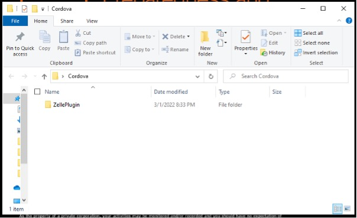
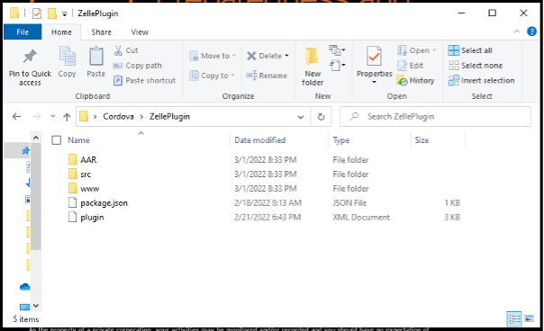
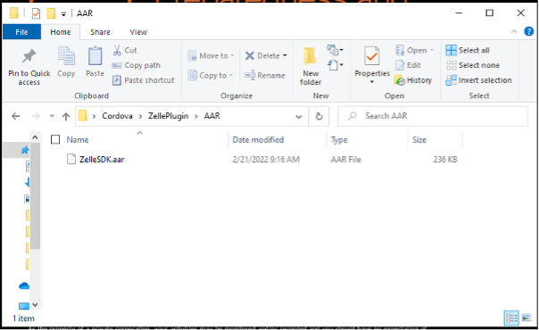
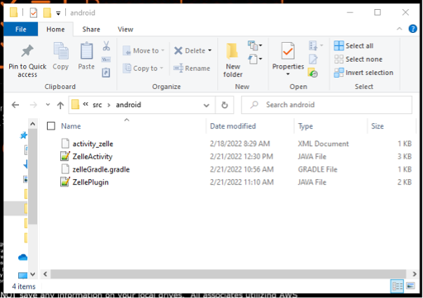
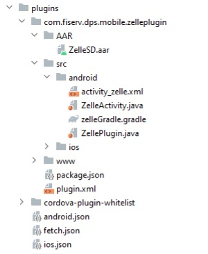
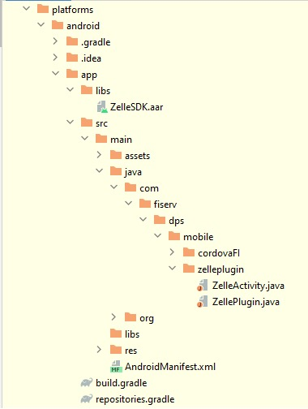
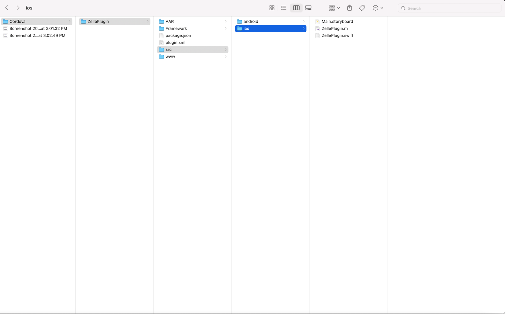
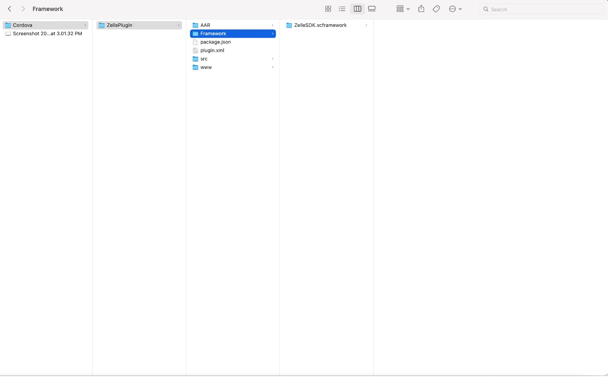
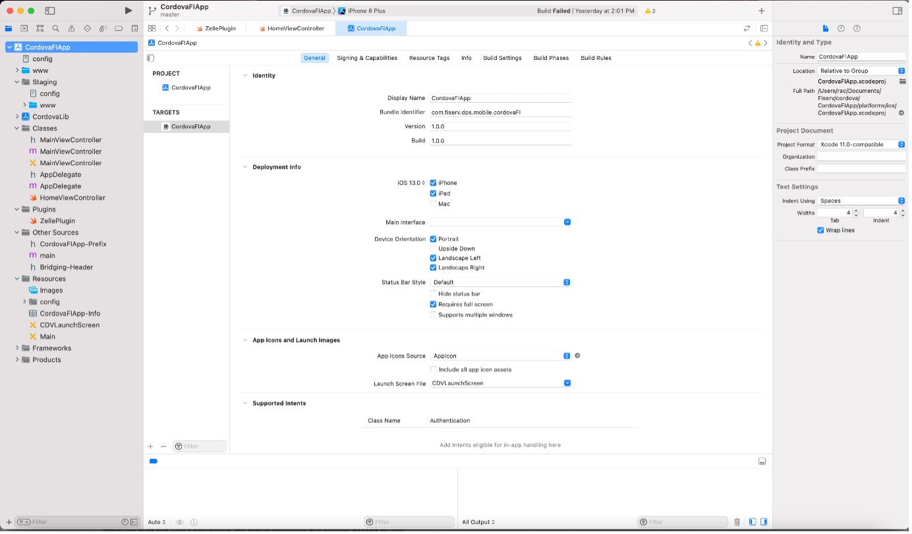

# Steps for Quick Start

## Project Setup

 1. Prerequisites:

- Node JS
- Cordova
- Android SDK
- Xcode
- Android Emulator (or) Real Device
- iOS Simulator (or) Real Device

## Cordova Plugin for ZelleSDK(Android)

2. To integrate ZelleSDK into any Cordova projects, plugin files will be created which will act a bridge between native code and JavaScript.

3. Plugin can be created using node.js for both android and iOS platform.

4. To create a plugin, plugin name, plugin id, plugin version and plugin package name are required.

   - Example package name: - com.zelle.sdk.plugin

5. Once plugin is created, it contains some of the files inside our created plugin folder.

6. Screenshot of plugin: - This refers to the plugin folder.



7. Screenshot of plugin Files: - This refers to the created plugin files.



8. Inside ZelleSDK Plugin folder except AAR folder all folders and files are automatically generated.

9. To access our ZelleSDK we can create AAR folder to place our SDK into it.

10. Screenshot refers to SDK file: -



11. In src folder, it has two folders which is android and iOS.

12. Inside the android and iOS folder, we have one java file for android which extends Cordova plugin.

13. And inside www folder we have a js file with same file name of java created in src android folder.

14. This js and native file only communicates with each other for passing the parameters from js to java.

15. Screenshot refers to files created inside android folder: -



16. For android, new java class and xml files can be created which will act as interface to access ZelleSDK.

17. In the plugin.xml file, location path for the created java, xml files can be added in android platform tag.

18. After plugin is created, this can be imported in any Cordova project to access ZelleSDK.

19. Below are the steps to integrate the plugin in Cordova project.

20. Navigate to respective Cordova project folder inside terminal to add the plugin.

    -      a. cordova plugin add your-plugin-local-path folder
    -         e.g. cordova plugin add "C:\Zelle SDK Plugin"
    -      b. cordova build “platform-name”
    -         e.g. . cordova build android

21. Screenshot refers to plugin added in Cordova project: -



22. After plugin is added, plugin files will be included in Cordova project.



23. ZelleSDK can be launched from any Cordova application by calling the function created in plugin folder(www/ZellePlugin.js) with the respective parameters like below.

24. Create the openZelle function in your .js file (e.g. index.js) and pass the required parameters to ZellePlugin.

```json
function openZelle(){
  var baseURL = document.getElementById("base_url");
  var institutionId = document.getElementById("institution_id");
  var ssoKey = document.getElementById("sso");
  var product = document.getElementById("product");
  var a = {};
var b = {};
var pd_contact= {
pd.tittle : ”tittle” ,
pd.message : ”test”
};

b.param1 = "value1";
b.param2 = "value2";
b.param3 = "value3";


var success = function(message) { console.log(message); }
var failure =  function() { alert("Error calling Hello Plugin"); }
a.applicationName = "Demo Cordova App";
a.baseURL = baseURL.value;
a.institutionId = institutionId.value;
a.product = product.value;
a.ssoKey = ssoKey.value;
a.parameters = b;
a. appData = pd.contact; // only pass contact
ZellePlugin.zelle_activity(person ,success,failure); //here we need to pass the data to zelle plugin like this
}
```

## Cordova Plugin for ZelleSDK(iOS)

1. To integrate ZelleSDK into any Cordova projects, plugin files will be created which will act a bridge between native code and JavaScript.

2. Plugin can be created using node.js for both android and iOS platform.

3. To create a plugin, plugin name, plugin id, plugin version and plugin package name are required.

   - Example: - com.zelle.sdk.plugin

4. Once plugin is created, it contains some of the files inside our created plugin folder.

5. Screenshot of plugin: - This refers to the plugin folder.



6. Inside ZelleSDK Plugin folder except Framework folder all folders and files are automatically generated.

7. To access our ZelleSDK we can create a Framework folder to place our SDK into it.

8. Screenshot refers to SDK file: -



9. In the src folder it has two folders which is android and iOS.

10. Inside iOS folder we have objective c/swift file which extends Cordova plugin.

11. Inside www folder we have a js file with same file name of Objective C/Swift file created in src.

12. This js and native file only communicates each other for passing the parameters from js to Objective C/Swift file.

13. For iOS, new objective c/swift and storyboard files can be created which will act as interface to access ZelleSDK.

14. In the plugin.xml file, location path for the created Objective c/Swift, storyboard files can be added in iOS platform tag.

15. For iOS, new Objective-C/Swift file e.g., HomeViewController and Storyboard file e.g., Main. Storyboard can be created which will act as interface to access ZelleSDK.

16. Below are the steps to integrate the plugin in Cordova project.

17. Navigate to respective Cordova project folder inside terminal to add our plugin.

    - a. cordova plugin add your-plugin-local-path folder
    - e.g., cordova plugin add "Users/Cordova/ZellePlugin"
    - b. cordova build “platform-name”
    - e.g., cordova build ios

18. Screenshot refers to plugin added in Cordova project: -



19. ZelleSDK can be launched from any Cordova application by calling the function created in plugin folder(www/ZellePlugin.js) with the respective parameters like below.

20. Create the openZelle function in your .js file (e.g. index.js) and pass the required parameters to ZellePlugin.

```json
function openZelle(){
  var baseURL = document.getElementById("base_url");
  var institutionId = document.getElementById("institution_id");
  var ssoKey = document.getElementById("sso");
  var product = document.getElementById("product");
  var a = {};
var b = {};
var pd_contact= {
pd.tittle : ”tittle” ,
pd.message : ”test”
};

b.param1 = "value1";
b.param2 = "value2";
b.param3 = "value3";

var success = function(message) {

console.log(message);
}
// session timeout callback
var failure =  function()
{ alert("Error calling Hello Plugin"); }

a.applicationName = "Demo Cordova App";
a.baseURL = baseURL.value;
a.institutionId = institutionId.value;
a.product = product.value;
a.ssoKey = ssoKey.value;
a.parameters = b;
a. appData = pd_contact;


ZellePlugin.zelle_activity(person ,success,failure); //here we need to pass the data to zelle plugin like this
}

```

## Sample Project:

[dps-zelle-sdk-testapp-cordova-master.zip](https://github.com/Fiserv/zelle-turnkey-solutions/files/11654405/dps-zelle-sdk-testapp-cordova-master.zip)
