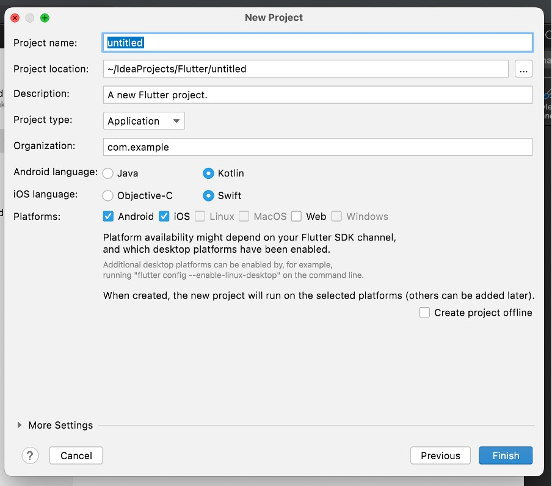
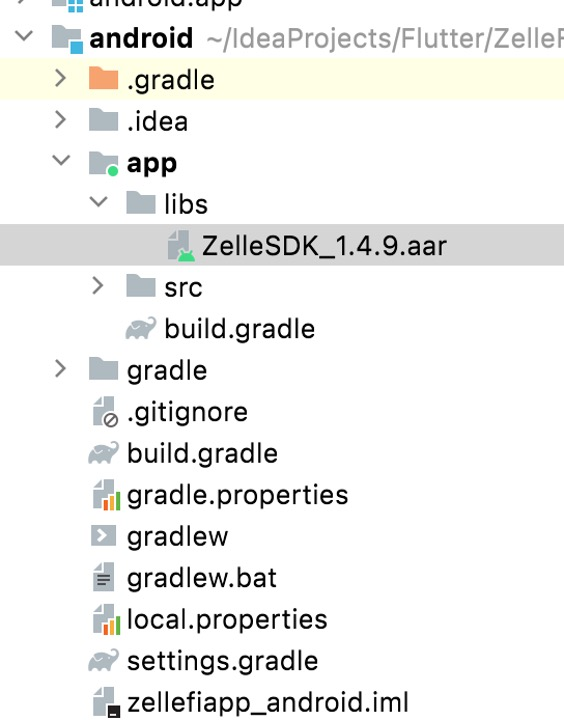
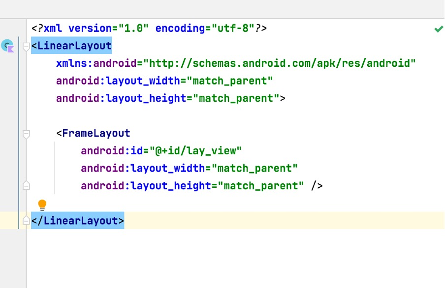
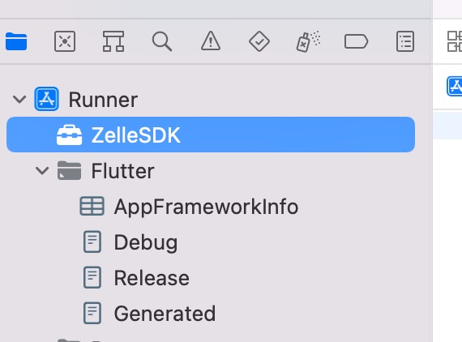
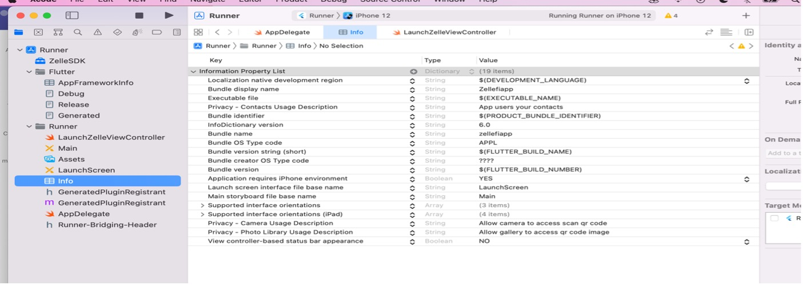

# Steps for Quick Start

## Project Setup

Prerequisites:

- Android studio or Xcode
- Flutter SDK
- Android Emulator or Real Device
- iOS Simulator or Real Device
- Android SDK

### 1. Create new Flutter application

Create new Flutter application with both Android and iOS platforms enabled.

- Set Package Name

  Select the project type as Application and provide a project name.

- Set Project Language

  Select specific language support for both Android and iOS and click Finish to create the project.



### 2. Create Zelle Dart class

After the project has been created, navigate to the src folder and create a Dart class with respective widget to launch Zelle®.

### 3. Create a Method Channel

To create a bridge between native code and Dart, construct a channel. Use a Method channel with a single platform method that returns the data from Dart to native code and vice versa.

### 4. Provide Channel Name

The client and host sides of a channel are connected through a channel name passed in the channel constructor.

All channel names used in a single app must be unique. Prefix the channel name with a unique ‘domain prefix’.
- Example: static const platform = MethodChannel(‘zellesdk.launch’);

```json
class _MyHomePageState extends State<MyHomePage> {
  static const platform = MethodChannel('zellesdk.launch');
```

### 5. Invoke a method on the method channel

Next, invoke a method on the method channel, specifying the concrete method to call using the String identifier launchZelle.

Pass the parameters to launch ZelleSDK.

```json
// Loader Data Initialization:
Map<String, String> loaderData = new HashMap();
map['loaderColor'] = "hex color code";
map['bgColor'] = "hex color code";

// AppData Initialization:
Map<String,Map<String, String>> pdData = new LinkedHashMap();
//contact
Map<String, String> contact_pd = new LinkedHashMap();
contact_pd['title'] = 'CONTACT TITLE';
contact_pd['message'] = 'CONTACT MESSAGE';

//camera
Map<String, String> camera_pd = new LinkedHashMap();
camera_pd['title'] = 'CAMERA TITLE';
camera_pd['message'] = 'CAMERA MESSAGE';

//gallery
Map<String, String> gallery_pd = new LinkedHashMap();
gallery_pd['title'] = 'GALLERY TITLE';
gallery_pd['message'] = 'GALLERY MESSAGE';

pdData['pd_contact'] = contact_pd;
pdData['pd_camera'] = camera_pd;
pdData['pd_gallery'] = gallery_pd;

//Parameter Initialization: 
Map<String, String> map = new HashMap();
map['param1'] = "";
map['param2'] = "";
map['param3'] = "";

//Zelle Constructor Initialization:
final String result = await platform.invokeMethod('launchZelle',{
'applicationName': _applicationNameController.text,
'baseUrl':_baseUrlController.text,
"institutionId":_institutionIdController.text,
'product':_productController.text,
'ssoKey': _ssoKeyController.text,
'fi_callback': true,
'loaderData': loaderData, //optional
'appData': pdData,   //Optional
'parameter':map}); //optional
```

Use the returned result to update the user interface state.

## Android Platform:

### 1. Create the libs folder

Open the Android platform inside Android studio and create the libs folder inside the app.

### 2. Import the ZelleSDK.aar file

Place the latest version of the ZelleSDK.aar file inside the libs folder.



### 3. Add Required Dependencies

Open the build.gradle file and inside dependencies add the required dependencies given below:

```json
implementation "org.jetbrains.kotlin:kotlin-stdlib-jdk7:$kotlin_version"
implementation 'androidx.appcompat:appcompat:1.4.2'
implementation 'com.google.android.material:material:1.4.0'
implementation 'androidx.constraintlayout:constraintlayout:2.1.4'
implementation('com.journeyapps:zxing-android-embedded:4.3.0') { transitive = false}
implementation 'com.google.zxing:core:3.4.0'
implementation 'androidx.core:core-ktx:1.6.0'
implementation fileTree(dir: 'libs', include: ['*.jar', '*.aar'])
```

### 4. Create a MethodChannel Inside Android Platform

Open the file MainActivity.kt located in the kotlin folder in the Project view. Inside the configureFlutterEngine() method, create a MethodChannel and call setMethodCallHandler(). Make sure to use the same channel name as was used on the Flutter client side.

### 5. Create LaunchZelle class file

Create a new activity to initialize and launch the ZelleSDK.

### 6. Get the arguments from the client side and pass those arguments to LaunchZelle.kt.

```json
MethodChannel(flutterEngine.dartExecutor.binaryMessenger, CHANNEL).setMethodCallHandler {
call, result ->
if (call.method == "launchZelle") {
genericTag = this
val hashMap = call.arguments as HashMap<*,*>
val  intent = Intent(this, LaunchZelle::class.java)
intent.putExtra("data", hashMap)startActivity(intent)
}
```

### 7. Create FrameLayout

Open the activity_launch_zelle.xml file inside the layout folder and create a FrameLayout to initialize the Zelle view.



### 8. Open the LaunchZelle.kt file and inside the onCreateView function initialize Zelle, Bridge, and BridgeView (or) BridgePopup with respective parameters.

```json
class LaunchZelle : AppCompatActivity() {
   override fun onCreate(savedInstanceState: Bundle?) {
     super.onCreate(savedInstanceState)
     setContentView(R.layout.activity_launch_zelle)

     if (intent != null) {
         val data = intent.getSerializableExtra("data") as HashMap<*, *>
         val zelle = Zelle(
         applicationName = data.get("applicationName") as String?,
         baseURL = data.get("baseUrl") as String,
         institutionId = data.get("institutionId") as String,
         product = data.get("product") as String,
         ssoKey = data.get("ssoKey") as String,
         fi_callback = false,  //optional one
         appData = data.get("appData") as Map<String, Map<String, String>>?,
         loaderData = null,
         parameters = data.get("parameter") as Map<String, String>
        )
        val bridge = Bridge(this, zelle)
        zelle.preCacheContacts = true
    //To show Bridge View
        val view = bridge.view()
        supportFragmentManager.beginTransaction().replace(R.id.lay_view, view).commit()

    //To show Bridge Popup
        val popup = bridge.popup()
        popup.show(supportFragmentManager  , popup.tag)
    }
  }
}
```
### 9. Set the Theme for SDK

Create ZelleTheme inside Styles (or) the Theme.xml file.

```json
<style name="ZelleTheme" parent="Theme.MaterialComponents.DayNight.NoActionBar">
<item name="android:windowBackground">?android:colorBackground</item>
</style>
```

### 10. Register the LaunchZelle.kt activity inside the application AndroidManifest.xml file with the respective theme.

```json
<application
android:name="${applicationName}"
android:icon="@mipmap/ic_launcher"
android:theme="@style/LaunchTheme"
android:label="zellefiapp">
        
<activity
android:name=".LaunchZelle"
android:theme="@style/ZelleTheme"
android:exported="false" />
```

#### Note:
- The appData parameter passed in Zelle is optional. It is used to show the customized alert passed from FI (only for Android, not for iOS).

- Default values:
    - Contacts:
      “title” => “We would like to access your phone contacts”,
      “message” => “We only sync phone numbers and email address from your contact list to help you add and pay a new recipient in Zelle®.
    - Camera:
      “title” => “We would like to access your camera”,
      “message” => “We only access your camera to help you add and pay a new recipient in Zelle®.
    - Gallery:
      “title” => “We would like to access your photos”,
      “message” => “We only access your photos to help you add and pay a new recipient in Zelle®.

- ZelleSDK launches from Minimum SDK version 24.
- To get the session tag value to the client side after the Zelle® session is closed, initialize genericTag and implement GenericTag to get the sessionTag value from ZelleSDK.
- “loaderData” is an optional parameter to pass hex color codes for custom loader. Keys to be used: “loaderColor” and ”bgColor”.

### 11. Inside the sessionTag override method, get the data from Zelle and send the result back to the client side.

```json
zelleResult = result as String;
if(zelleResult.isNotEmpty){
print('SessionTag-------------------${zelleResult}');
}
} on PlatformException catch (e) {
zelleResult = "Failed to get result: '${e.message}'.";
}
```

### 12. Initialize GenericTag

Inside the getValue override method get the data from Zelle and send the result back to the client side.

## iOS Platform:

### 1. Create a ViewController

Open the iOS platform inside Xcode and create a new ViewController to launch Zelle®.

### 2. Place the ZelleSDK XCframework file inside the Runner.



### 3. Add the ZelleSDK required permissions (i.e., contact, camera, gallery) in the Info.plist file.



### 4. Open the file AppDelegate.swift located under Runner > Runner in the Project navigator.

### 5. Override the application:didFinishLaunchingWithOptions: function and create a FlutterMethodChannel tied to the channel name zellesdk.launch.

```json
  override func application(
_ application: UIApplication,
didFinishLaunchingWithOptions launchOptions: [UIApplication.LaunchOptionsKey: Any]?
) -> Bool {
let controller : FlutterViewController =  FlutterViewController()

let navigationController = UINavigationController(rootViewController: controller)
self.window.rootViewController = navigationController
navigationController.isNavigationBarHidden = true

let zelleChannel = FlutterMethodChannel(name: "zellesdk.launch",
binaryMessenger: controller.binaryMessenger)
```

### 6. Get the arguments from the client side and pass them to the created ViewController inside the FlutterMethodChannel in AppDelegate.

```json
let zelleChannel = FlutterMethodChannel(name: "zellesdk.launch",
binaryMessenger: controller.binaryMessenger)
zelleChannel.setMethodCallHandler({
(call: FlutterMethodCall, result: @escaping FlutterResult) -> Void in
if call.method == "launchZelle" {
let data = call.arguments
let mainVC:LaunchZelleViewController = LaunchZelleViewController()
let nextVC = UIStoryboard(name: "Main", bundle: nil).instantiateViewController(withIdentifier: "LaunchZelleViewController") as!
LaunchZelleViewController
nextVC.getData = data as? NSDictionary
nextVC.flutterResult = result
navigationController.pushViewController(nextVC, animated: true)

} else {
result(FlutterMethodNotImplemented)
return
}
})
```

### 7. Open the created ViewController, and inside the viewDidLoad() function initialize Zelle, Bridge, and BridgeView (or) BridgePopup to launch Zelle.

```json
override func viewDidLoad() {
  super.viewDidLoad()
  Bridge.genericTag = self
  appName = getData?.value(forKey: "applicationName") as? String
  baseUrl = getData?.value(forKey: "baseUrl") as? String
  institutionId = getData?.value(forKey: "institutionId") as? String
  product = getData?.value(forKey: "product") as? String
  ssoKey = getData?.value(forKey: "ssoKey") as? String
  parameters = getData?.value(forKey: "parameter") as? NSDictionary

  let zelle = Zelle(
  applicationName : appName,
  baseURL: baseUrl ?? "",
  institutionId: institutionId ?? "",
  product: product ?? "",
  ssoKey: ssoKey ?? "",
  loaderData: nil,
  parameters: parameters  as! [String : String]
)

lazy var bridge: Bridge = {
Bridge(config: zelle,
viewController: self
)
}()

let zelleFrame = CGRect(x:0, y:0, width: view.frame.width, height: view.frame.height) //desired location
let zelleView = bridge.view(frame: zelleFrame)

//  let zelleView = bridge.popup(anchor: self.view)
view.addSubview(zelleView)
}
```

### 8. Pass the required variables to the Zelle class that is passed from the client side.

#### Notes:
- XCframework requires minimum version iOS - 13.
- “loaderData” is an optional parameter to pass hex color codes for custom loader. Keys to be used “loaderColor” and ”bgColor”.
- To get the session tag value to the client side after the Zelle® session is closed, initialize genericTag and implement GenericTagDelegate to get the tag value from ZelleSDK.

```json
import UIKit
import ZelleSDK
class LaunchZelleViewController: UIViewController, GenericTagDelegate {
func getValue(name: String) {
print("\(name)")
}

var getData:NSDictionary?
var flutterResult:FlutterResult?
var appName:String? = ""
var baseUrl:String? = ""
var institutionId:String? = ""
var product:String? = ""
var ssoKey:String? = ""
var parameters:NSDictionary? = NSDictionary()
var callBack:String? = ""

func sessionTag(name tag: String) {
flutterResult!("\(tag)")
}
```
- Inside the sessionTag override method, get the data from Zelle and send the result back to the client side.
- Before sending data back to the client side, initialize the FlutterResult variable created in ViewController from AppDelegate.

```json
let nextVC = UIStoryboard(name: "Main", bundle: nil).instantiateViewController(withIdentifier: "LaunchZelleViewController") as!
LaunchZelleViewController
nextVC.getData = data as? NSDictionary
nextVC.flutterResult = result
navigationController.pushViewController(nextVC, animated: true)
```
### Kotlin Version Used in Sample Project

1.6.10

### Sample Project:

[dps-zelle-sdk-testapp-flutter.zip](https://github.com/Fiserv/zelle-turnkey-solutions/files/12375839/dps-zelle-sdk-testapp-flutter.zip)

