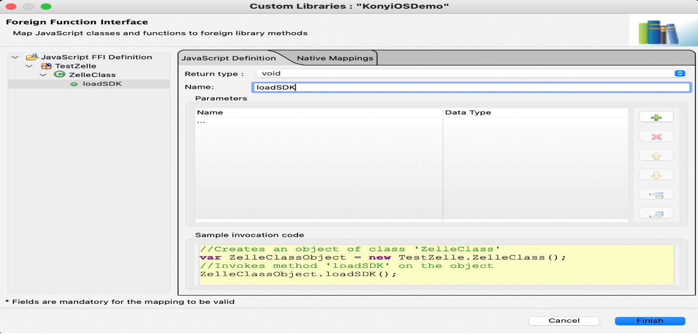

# Kony Integration (Android)

Prerequisites: Kony Visualizer 8, Android, Xcode, Android emulator/Android phone, iOS simulator/iPhone

There are 2 approaches to integrate ZelleSDK with Kony Project

- Integrating ZelleSDK with Kony using KonyAdapter class to launch the ZelleSDK in a separate window.
- Integrating ZelleSDK with Kony using KonyWrapper method in Android studio to embed the ZelleSDK in Kony Container.

## I. Integrating ZelleSDK with Kony using KonyAdapter

### 1. Create Android Application with an Activity

Go to Android Studio and create a new project with an activity. Name the app “ZelleKonyFFI”.

### 2. Create konyAdapter Class

The adapter class will be the bridge between Kony and Android.

- Import KonyWidget.jar and ZelleSDK.aar in the Android project:
  - To add KonyWidget.jar, right click on your project > Open Module settings > Modules > +(click to add new Modules) > Import JAR/AAR Package > Next. Select the KonyWidget.jar
  - To add ZelleSDK.aar, right click on your project > Open Module settings > Modules > +(click to add new Modules) > Import JAR/AAR Package > Next. Select the ZelleSDK.aar or move ZelleSDK.aar to the libs folder.

- Update build.gradle with the following dependency:

```json
implementation project(path: ':konywidgets') 
```

- Create the adapter class. Go to app > java > (package name) > Right click > New > Java class. Name the java file “konyAdapter”:

```json
public class konyAdapter  {   
  static Function callbackTestKony ;  
  public static void initializetoSDK(Function callback, JSONObject options) { 
    MainActivity.mainCallback = callback; 
    KonyMain context; 
    context = KonyMain.getActivityContext(); 
    if(context != null) { 
      Intent intent = new Intent(context, MainActivity.class); 
      intent.putExtra("ZelleObject", options.toString()); 
      KonyMain.getActivityContext().startActivity(intent); 
    }  
  }  
} 
```

- Update the MainActivity.java class with the following code.

```json
public class MainActivity extends AppCompatActivity implements GenericTag { 
    @Override 
    protected void onCreate(Bundle savedInstanceState) { 
      super.onCreate(savedInstanceState); 
      String package_name = getApplication().getPackageName(); 
      setContentView(getApplication().getResources().getIdentifier("activity_zelle", "layout", package_name)); 
      Intent intent = getIntent(); 
      try { 
        if (intent != null){ 
          JSONObject jsonObject = new JSONObject(intent.getStringExtra("ZelleObject")); 
          HashMap<String, String> param = new Gson().fromJson(jsonObject.getString("parameters"), HashMap.class);
          HashMap<String, String> loaderData = new Gson().fromJson(jsonObject.getString("loaderData"), HashMap.class);
          HashMap<String, HashMap<String, String>> appData = new Gson().fromJson(jsonObject.getString("appData"), HashMap.class);
          Zelle zelle = new Zelle( 
            jsonObject.getString("applicationName"), 
            jsonObject.getString("baseURL"), 
            jsonObject.getString("institutionId"), 
            jsonObject.getString("product"), 
            jsonObject.getString("ssoKey"),
            jsonObject.getBoolean("fi_callback"),
            loaderData,
            appData,
            param 
          ); 
          Bridge bridge = new Bridge(ZelleActivity.this, zelle); 
          zelle.setPreCacheContacts(true); 
          BridgeView view1 = bridge.view(); 
          getSupportFragmentManager().beginTransaction().replace(R.id.textView, view1).commit(); 
        } 
      }  
      catch (JSONException e) { 
        e.printStackTrace(); 
      } 
    } 
    @Override public void sessionTag(@NonNull String s) {   
      String returndata[] = new String[1]; 
      returndata[0] = s 
      try { 
        mainCallback.execute(returndata); 
      }  
      catch (Exception e) { 
        e.printStackTrace(); 
      }  
    } 
}
```

- Update the activity_zelle.xml with the following code

```json
<?xml version="1.0" encoding="utf-8"?>
<androidx.constraintlayout.widget.ConstraintLayout xmlns:android=http://schemas.android.com/apk/res/android 
  xmlns:tools=http://schemas.android.com/tools 
  android:layout_width="match_parent" 
  android:layout_height="match_parent" 
  xmlns:app=http://schemas.android.com/apk/res-auto> 

  <FrameLayout 
    android:layout_width="match_parent" 
    android:layout_height="match_parent" 
    android:text="Zelle Activity" 
    android:id="@+id/textView" 
    app:layout_constraintTop_toTopOf="parent" /> 

</androidx.constraintlayout.widget.ConstraintLayout> 
```

- Update the build.gradle file “com.android.application” to “com.android.library”.

### 3. Generate AAR File

- Update the build configuration dialogue from app to ZelleKonyFFI: app[build] and run the project.

- The AAR file will be generated and can be accessed from the location as ZelleKonyFFI > app > build > output > aar > app-release.aar

### 4. Create Kony App

- Go to Kony Visualizer File > New Project > Create custom app. Name the project “ZelleKonyFFI”.

- Create a new mobile form with a welcome label and button.

- Copy the “app-release.aar” file into the Kony folder ZelleKonyFFI > resources > customlibs > lib > android.

### 5. Import AAR in Kony and Configure Kony FFI

- In Kony Visualizer, go to Edit > Integrate Third Party > Manage Custom Libraries.

- Add the new JavaScript namespace “com.mki.zellekonyffi”.

- Inside the JavaScript namespace, add the new function “initializeFFI” and add an input parameter of Function type with the name “fficallback”.

- Navigate to Native Mappings > Android and select the Library “app-release.aar”.

- Provide the package name as “com.mki.zellekonyffi”, the class as “konyAdapter”, and the static method as “initializetoSDK”.

- Select Finish to generate the Foreign Function Interface (FFI). An FFI is a mechanism that provides support for an application written in one programming language to use the methods, functions, and services written in another programming language.

- Go to Project Settings > Native > Android > Gradle entries and add the AAR dependencies:

```json
dependencies{ 
  implementation fileTree(dir: 'libs', include: ['*.jar']) 
  implementation 'com.google.android.material:material:1.0.0' 
  implementation 'com.android.support.constraint:constraint-layout:1.1.3' 
  implementation('com.journeyapps:zxing-android-embedded:4.2.0') { transitive = false} 
  implementation 'com.google.zxing:core:3.4.0' 
} 

  android { defaultConfig { renderscriptSupportModeEnabled false}} 
```

- For the Kony button action, add the following code:

```json
//Invokes function 'initializeFFI' 
var j = self.view.url.text;

var pdContact = {
title :"Contact Title",
message :"Contact Message",
};

var pdCamera = {
title :"Camera Title",
message :"Camera Message",
};

var pdPhoto = {
title :"Gallery Title",
message :"Gallery Message",
};

var appData = {
pd_contact :pdContact,
pd_camera  :pdCamera,
pd_gallery :pdPhoto,
};

var loaderData = {
loaderColor :"hex color code",
bgColor :"hex color code",
};

var zelleparam = { 
  param1 :"value1", 
  param2 :"value2", 
  param3 :"value3", 
}; 

var Zelleparam = { 
  applicationName :"Demo Kony App", 
  baseURL: j , 
  institutionId : "institutionId.value", 
  product : "", 
  ssoKey :"", 
  fi_callback : false,
  loaderData : loaderData,
  appData :  appData,       
  parameters : zelleparam 
} 

//Zelle Function call  
com.mki.zellekonyffi.initializeFFI(ffiCallback, Zelleparam); 

//session timeout  
function ffiCallback(data){ 
  alert(data);  
} 
```

## II. Integration of ZelleSDK with Kony Project using KonyWrapper

### 1. Create Android Application with a Wrapper class

Go to Android Studio and create a new project with a class. Name the app “ZelleKonyNFI”.

### 2. Create KonyWrapper Class

The wrapper class will contain the method that will return the ZelleUI to the Kony app to embed in the Kony container.

- Import KonyWidget.jar and ZelleSDK.aar in the Android project:
  - To add KonyWidget.jar, right click on your project > Open Module settings > Modules > + (click to add new Modules) > Import JAR/AAR Package > Next. Select the KonyWidget.jar
  - To add ZelleSDK.aar, right click on your project > Open Module settings > Modules > + (click to add new Modules) > Import JAR/AAR Package > Next. Select the ZelleSDK.aar or move ZelleSDK.aar to the libs folder.

- Update build.gradle with the following dependency:

```json
implementation project (path: ':konywidgets') 
```

- Create the wrapper class. Go to app > java > (package name) > Right click > New > Java class. Name the java file “KonyWrapper”:

```json
public class KonyWrapper { 

    LinearLayout linearLayout;
    private static final int CONTENT_VIEW_ID = 10101010; 

    @SuppressLint({"SetJavaScriptEnabled", "ResourceType"})
    public LinearLayout initializetoSDK(JSONObject jsonObject) { 

            Context konyAppContext = KonyMain.getAppContext();
            FragmentManager konyManager = KonyMain.getActFragmentManager();
            this.linearLayout = new LinearLayout(konyAppContext);
            this.linearLayout.setLayoutParams(new
            LinearLayout.LayoutParams(ViewGroup.LayoutParams.MATCH_PARENT,
            ViewGroup.LayoutParams.MATCH_PARENT));
            this.linearLayout.setOrientation(LinearLayout.VERTICAL);
            this.linearLayout.setPadding(100, 0, 0, 0);
            LinearLayout.LayoutParams rightGravityParams = new LinearLayout.LayoutParams(-1, -1);

            HashMap<String, String> param = new Gson().fromJson(jsonObject.getString("parameters"), HashMap.class);
            HashMap<String, String> loaderData = new Gson().fromJson(jsonObject.getString("loaderData"), HashMap.class);
            HashMap<String, HashMap<String, String>> appData = new Gson().fromJson(jsonObject.getString("appData"), HashMap.class);

              Zelle zelle = new Zelle(
                   jsonObject.getString("applicationName"), //applicationName (Optional)
                   jsonObject.getString("baseURL"), //baseURL
                   jsonObject.getString("institutionId"), //institutionId
                   jsonObject.getString("product"), //product
                   jsonObject.getString("ssoKey"), // ssoKey
                   jsonObject.getBoolean("fi_callback"),
                   loaderData,
                   appData,
                   param
               ); 

          Bridge bridge = new Bridge (KonyMain.getActivityContext(), zelle);
          zelle.setPreCacheContacts(true);
          BridgeView bridgeView = bridge.view();
          LinearLayout bridgeLayout = new LinearLayout(konyAppContext);
          bridgeLayout.setOrientation(LinearLayout.VERTICAL);
          LinearLayout.LayoutParams parms = new
          LinearLayout.LayoutParams(ViewGroup.LayoutParams.MATCH_PARENT,
          ViewGroup.LayoutParams.MATCH_PARENT);
            bridgeLayout.setLayoutParams(parms);
            bridgeLayout.setId(1234);
            konyManager.beginTransaction().add(bridgeLayout.getId(), bridgeView,
            "BridgeView").commit();
         return bridgeLayout;
    } 
```

- Update the build.gradle file “com.android.application” to “com.android.library”.

### 3. Generate AAR File

- Update the build configuration dialogue from app to ZelleKonyNFI: app[build] and run the project.

- The AAR file will be generated and can be accessed from the location as ZelleKonyNFI > app > build > output > aar > app-release.aar.

### 4. Create Kony App

- Go to Kony Visualizer File > New Project > Create custom app. Name the project “ZelleKonyNFI”.

- Create a new mobile form with a welcome label and button.

- Copy the “app-release.aar” file into the Kony folder ZelleKonyNFI > resources > customlibs > lib > android.

### 5. Import AAR in Kony and Configure Kony NFI

- In Kony Visualizer, go to Edit > Integrate Third Party > Manage Custom Libraries.

- Add the new JavaScript namespace “com.mki.zellekonynfi”.

- Inside the JavaScript namespace, add the new function “initializeNFI” and add an input parameter of JSONObject type with the name “ZelleParam”.

- Navigate to Native Mappings > Android and select the library “app-release.aar”.

- Provide the package name as “com.mki.zellekonynfi”, the class as “KonyWrapper”, and the static method as “initializeSDK”.

- Select Finish to generate the Native Function Interface (NFI). An NFI is a mechanism that provides support for an application written in one programming language to use the methods, functions, and services written in another programming language.

- Go to Project Settings > Native > Android > Gradle entries and add the AAR dependencies:

```json
dependencies { 
  implementation fileTree(dir: 'libs', include: ['*.jar']) 
  implementation 'com.google.android.material:material:1.0.0' 
  implementation 'com.android.support.constraint:constraint-layout:1.1.3' 
  implementation('com.journeyapps:zxing-android-embedded:4.2.0') { transitive = false} 
  implementation 'com.google.zxing:core:3.4.0' 
} 

  android {defaultConfig { renderscriptSupportModeEnabled false}} 
```

- For the Kony button action, add the following code:

```json
//Invokes function 'initializeNFI' 
var j = self.view.url.text;

var pdContact = {
title :"Contact Title",
message :"Contact Message",
};

var pdCamera = {
title :"Camera Title",
message :"Camera Message",
};

var pdPhoto = {
title :"Gallery Title",
message :"Gallery Message",
};

var appData = {
pd_contact :pdContact,
pd_camera  :pdCamera,
pd_gallery :pdPhoto,
};

var loaderData = {
loaderColor :"hex color code",
bgColor :"hex color code",
};

var zelleparam = {
param1 :"value1",
param2 :"value2",
param3 :"value3",
};

var Zelleparam = {
applicationName :"Demo Kony App",
baseURL: j ,
institutionId : "institutionId.value",
product : "",
ssoKey :"",
fi_callback : false,
loaderData : loaderData,
appData :  appData,
parameters : zelleparam
}

//Zelle Function call that will return ZelleView that can integrated in Kony Container. 
com.mki.zellekonyffi.initializeNFI(Zelleparam); 
```

- Launch the app in the simulator/device and click on the button to launch the Turnkey Service for Zelle® Mobile SDK.

Note: Kony plugin should be used with latest Turnkey Service for Zelle Mobile SDK version.

# Kony Integration (iOS)

### 1. Create a Sample iOS Application with a ViewController

- Go to Xcode and create a new iOS (Objective-C) application with the name “DemoFFI”.

- Add the file ZelleSDK.xcframework in the dependency module.


- Create the ViewController class in the DemoFFI project along with the storyboard UI.

- The ViewController method named “loadZelleSDK” contains logic to initialize the Turnkey for Zelle® Mobile SDK.

ViewController.h


ViewController.m


- Copy the ViewController.h, ViewController.m, and Main.storyboard files from the project to a separate folder named DemoFFI. Create a zip file of the folder.


### 2. Create the KonyiOSDemo Project in Kony Visualizer

- Create a project and name it “KonyiOSDemo”. When you create the project, it will auto generate several files and folders.


- Navigate to KonyiOSDemo/resources/customlibs/lib/iPhone and paste the DemoFFI.zip here.


- Go to Edit > Integrate Third Party > Manage Custom Libraries to create the FFI (Foreign Function Interface).


- Create a package named TestZelle.


- Create a javascript class ZelleClass inside the TestZelle package.


- Navigate to Native Mappings > Mobile > iPhone and add the details for the DemoFFI.zip file.


- Navigate to JavaScript Definition and create a javascript function named loadSDK.



- Navigate to Native Mappings and map loadSDK to the class method definition (ViewController’s loadZelleSDK). Select Finish.


- In Forms, add a button (btnSDK in this example) to Form1 with the label name “Launch Zelle”.


- Create a listener.js file in the Modules folder and add the following code snippets.

```json
function launchSDK() { 
  //Creates an object of class 'ZelleClass' 
  var ZelleClassObject = new TestZelle.ZelleClass(); 
  //Invokes method 'loadSDK’ on the object 
  ZelleClassObject.loadSDK(); 
} 
```


- Connect the launchSDK function created in the listener.js file with the button’s onClick event (in this example, ACTION_ID: AS_Button_ac7a6fa704074ad68a17f9daa05d736c).


- Launch the app in the simulator/device and click on the Launch Zelle button to launch the Turnkey Service for Zelle® Mobile SDK.


Note: Kony plugin should be used with latest Turnkey Service for Zelle® Mobile SDK version. 
