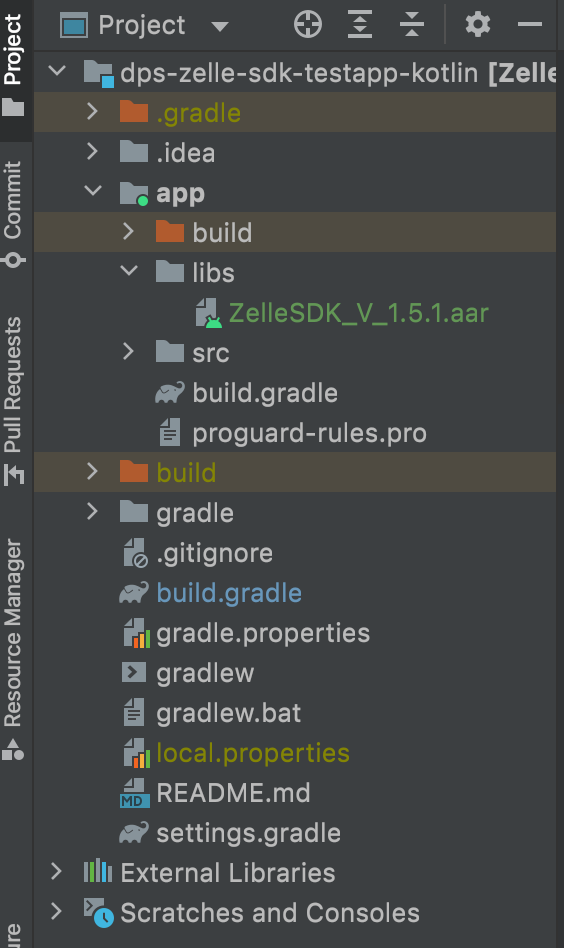

# Steps for Quick Start 

## Project Setup 

### 1. Add ZelleSDK.aar to your project libs folder:



### 2. Add the following line to the app module Gradle file dependencies:

```json
implementation files ('libs/ZelleSDK.aar')
implementation 'androidx.core:core-ktx:1.5.0'
implementation 'androidx.appcompat:appcompat:1.3.0'
implementation 'com.google.android.material:material:1.3.0'
implementation 'androidx.constraintlayout:constraintlayout:2.0.4'

//QR Code reader
implementation('com.journeyapps:zxing-android-embedded:4.2.0') {transitive = false}
implementation 'com.google.zxing:core:3.3.3' 
```

### 3. Import ZelleSDK where needed in any source code file:

```json
import com.fiserv.dps.mobile.sdk.bridge.model.* 
import com.fiserv.dps.mobile.sdk.bridge.controller.Bridge 
```

### 4. Device Orientation Support (Optional) 

Add the configChanges below to the launching ZelleLaunchingActivity class in the Manifest file: 

```json
android:configChanges="keyboardHidden|orientation|screenSize|layoutDirection|uiMode" 
```

### 5. Create a Zelle bridge configuration object.

```json
val pdContact = mapOf( 
    "title" to "We would like to access your phone contacts", 
    "message" to "We only sync phone numbers and email addresses from your contact list to help you add and pay a new recipient in Zelle®" 
) 
val pdCamera = mapOf( 
    "title" to "We would like to access your camera", 
    "message" to "We only access your camera to help you add and pay a new recipient in Zelle®" 
) 
val pdPhotos = mapOf( 
    "title" to "We would like to access your photos", 
    "message" to "We only access your photos to help you add and pay a new recipient in Zelle®" 
) 

val zelle = Zelle( 
    applicationName = "Demo Bank", //Optional 
    baseURL = "https://certtransfers.fta.cashedge.com/popnet/faces/loginServlet", 
    institutionId = "88850000", 
    product = "zelle", 
    ssoKey = "e78abf35705a6d9b51fbf3939aa82489", 
    fi_callback = true, // Mandatory when handling getValue method otherwise optional 
    loaderData= mapOf( 
	  "loaderColor" to "hex color", 
	  "bgColor" to "hex color" 
    ),	//Optional	 

    appData= mapOf( 
        "pd_contact" to pdContact, 
        "pd_camera" to pdCamera, 
        "pd_gallery" to pdPhotos 
    ), //Optional 
    parameters = mapOf( 
        "key1" to "value1", 
        "key2" to "value2", 
        "key3" to "value3" 
    ) //Optional unless Zelle is accessed through Bill Pay 
) 
```

Note: 

- ZelleSDK will automatically add the appropriate default values for these parameters to the URL: product.version and container (mobile_sdk_android).

### 6. Create a Bridge object (optional lazy implementation).

```json
private val bridge: Bridge by lazy {  
    Bridge( 
        activity = this,  
        config = zelle  
    ) 
} 
```

Note: 

- Pass the appropriate parent appActivity (type Activity) to activity. 

### 7. Launch Zelle® inside another view using code initialization (Recommended) 

If replacing an existing WebView, replace existing WebView with BridgeView. 

```json
// optionally: set the contact pre-caching flag (default: false) 
zelle.preCacheContacts = true 

val zelleView = bridge.view() 
supportFragmentManager.beginTransaction().apply { 
   replace(R.id.desiredLocation, zelleView)  
   commit () 
} 
```

### Launch Zelle® as a popup (not inside another view) 

```json
// optionally: set the contact pre-caching flag (default: false) 
zelle.preCacheContacts = true 

val zellePopup = bridge.popup() 
zellePopup.show(supportFragmentManager, zellePopup.tag) 
```

### Session Timeout and Intercepting Web Links 

```json
//Implement the GenericTag with Activity/Fragment
Class ZelleLaunchFragment: Fragment (), GenericTag{ 
  override fun onCreateView(inflater: LayoutInflater, container ViewGroup?, savedInstanceState: Bundle?) { 
    _binding = FragmentZelleLaunchBinding.inflater.inflate(inflater, container, false) 
    //Initialize generic tag 
    genericTag = this 
  return binding.root 
  } 
}

//Inside the class override the sessionTag method & getValue method
override fun sessionTag(name: String) { 
    if (name == “Landing”){ 
        //Here navigates the application to the desired screen. (This function will be triggered after the session expires)  
    } 
} 

// If the parent app has passed true for the fi_callback parameter, if the user  
// clicks on a web link such as the "Privacy Policy" link on the Zelle UI, then  
// the getValue method will be triggered and pass "privacy policy" as the value  
// for the name parameter. The parent app handles this callback on their side. 

override fun getValue(name: String) {
 if (name == “TAG_NAME”) {
 //Here navigates the application to the desired screen. (This function will help to communicate between Zelle UI and parent app)

} 
```

### Supported Versions

- Minimum SDK: 24
- Minimum OS: Android 7.0 Nougat

### Kotlin Version Used in Sample Project

1.5.0

### Zelle Mobile SDK Size

224 KB

### Dependency

zxing:core - 3.3.3 ([QR Code library](https://github.com/journeyapps/zxing-android-embedded))

### Sample Project

[dps-zelle-sdk-testapp.zip](https://github.com/Fiserv/zelle-turnkey-solutions/files/12375764/dps-zelle-sdk-testapp.zip)


