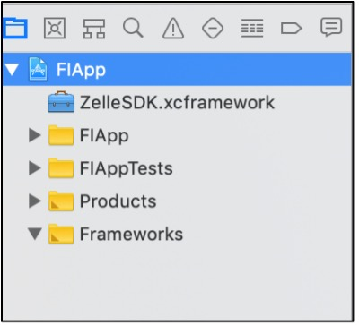
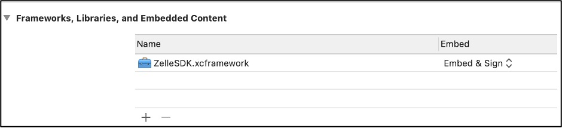

# Steps for Quick Start 

## Project Setup 

### 1. Open the file info.plist (right-click > Open As > Source Code). Add the following keys to the file: 

```json
<key>NSContactsUsageDescription</key>
<string>[PERMISSION_DESCRIPTION]</string>

<key>NSCameraUsageDescription</key>
<string>[PERMISSION_DESCRIPTION]</string>

<key>NSPhotoLibraryUsageDescription</key>
<string>[PERMISSION_DESCRIPTION]</string> 
```

### 2. Import ZelleSDK.xcframework for the required target under project settings (Project > Target > Frameworks, Libraries, and Embedded Contents). 

### 3. Set ZelleSDK.xcframework to “Embed & Sign”: 





### 4. Import ZelleSDK as needed in any source code files. 

### 5. Create a Zelle bridge configuration object. 

```json
private let zelle = Zelle(

applicationName: "Demo Bank", // Optional 
baseURL: "https://certtransfers.fta.cashedge.com/popnet/faces/loginServlet",
institutionId: "88850000",
product = "zelle",
ssoKey: "e78abf35705a6d9b51fbf3939aa82489",
fi_callback: true, //Mandatory when handling getValue method otherwise optional 

loaderData: [
"loaderColor" : "hex color",
"bgColor" : "hex color",
], // Optional (Nullable)     

parameters: [
"key1" : "value1",
"key2" : "value2",
"key3" : "value3"
] // Optional (Nullable) unless Zelle is accessed through Bill Pay 
) 
```

#### Note:
- ZelleSDK will automatically add the appropriate default values for these parameters to the URL: product.version and container (mobile_sdk_ios). 

### 6. Create a Bridge object (optional lazy implementation). 

#### Note:
- Pass the appropriate parent ViewController (type UIViewController) to self. 

```json
private lazy var bridge: Bridge = {

Bridge(

config: zelle,
viewController: self
)
} 
```

### 7. Launch Zelle® inside another view using code initialization (Recommended):

```json
let zelleFrame = CGRect(x:0, y:0, width:view.frame.width, height:view.frame.height)  //  Custom  Frame Size 

let zelleView = bridge.view(frame:zelleFrame)

view.addSubview(zelleView) 
```

### 8. Set the GenericTagDelegate Protocol delegate to the existing ViewController:

```json
Bridge.genericTag = self 
```

### 9. Launch Zelle® inside another view and fill it (for screen orientation):

```json
let zelleView = bridge.view()
zelleView.fill(view) 
```

### 10. Launch Zelle® as a popup (not inside another view):

```json
let zellePopup = bridge.popup()
zellePopup.anchor(to: view) 
```

### 11. Session Timeout and Intercepting Web Links:

```json
//Implement the GenericTagDelegate with ParentViewController 

Class ZelleViewController: UIViewController, GenericTagDelegate{


//Inside the class override the sessionTag & getValue method 

func sessionTag(name: String){
if (name == “Landing”) {
//Here navigates the application to the desired screen. (This function will be triggered after the session expires)  
}
}

// If the parent app has passed true for the fi_callback parameter, if the user  
// clicks on a web link such as the "Privacy Policy" link on the Zelle UI, then  
// the getValue method will be triggered and pass "privacy policy" as the value  
// for the name parameter. The parent app handles this callback on their side. 

func getValue(name: String) {
if (name == “TAG_NAME”) {
//Here navigates the application to the desired screen. (This function will help to communicate with the Zelle UI and parent app)  
}
}

} 
```

### 12. Supported Versions:

- Minimum Xcode Version: 11 
- Minimum OS: iOS 13 

### 13. Zelle Mobile SDK Size:

2.6 MB (size includes simulator) 

### 14. Dependency:

QRCodeReader - 10.1.0 (QR Code library) 

### Sample Project

[dps-zelle-sdk-testapp-ios-master.zip](https://github.com/Fiserv/zelle-turnkey-solutions/raw/develop/dps-zelle-sdk-testapp-ios-master.zip)


