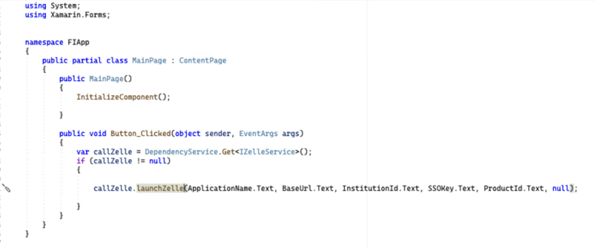
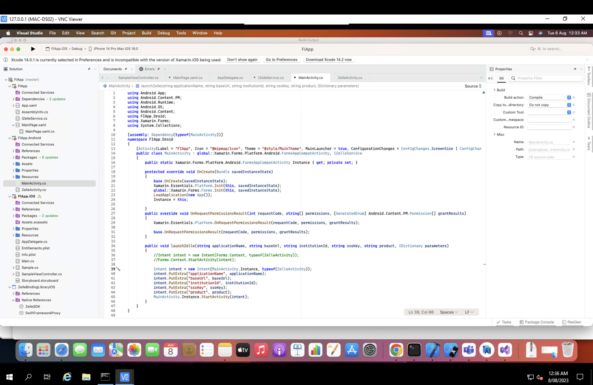
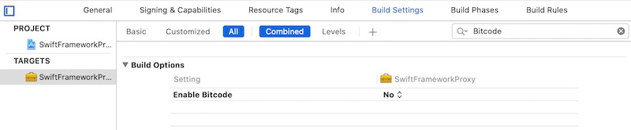

# Steps for Quick Start

## Project Setup

Prerequisites:

- Visual studio
- Xamarin
- Android SDK
- Xcode
- Android Emulator or Real Device
- iOS Simulator or Real Device

### 1. Create Interface Class

Create the IZelleService.cs interface class inside a Xamarin solution.

This IZelleService.cs class will create a bridge between the Xamarin solution to Xamarin Android and iOS.


Code Snippet for IZelleService Interface class:

```json
using System;
using System.Collections;

namespace FIApp
{
    public interface IZelleService
  {
      void launchZelle(String applicationName, String baseUrl, String institutionId, String ssoKey, String product, IDictionary data);
  }
}
```

### 4. Launch Zelle® using DependencyService

In the Xamarin solution, launch Zelle® by passing the required parameters through the interface by using DependencyService.



```json
using System;
using Xamarin.Forms;
        
namespace FIApp
{
    public partial class MainPage : ContentPage
  {
    public MainPage()
  {
  InitializeComponent();

}

public void Button_Clicked(object sender, EventArgs args)
  {
    var callZelle = DependencyService.Get<IZelleService>();
    if (callZelle != null)
      {

      callZelle.launchZelle(ApplicationName.Text, BaseUrl.Text, InstitutionId.Text, SSOKey.Text, ProductId.Text, null);

     }
    }
  }
}
```

## ZelleSDK Integration for Xamarin(Android)

### 1. Import Library

Add the required libraries from NuGet for Xamarin Android inside <AppName.android>.Packages.

The libraries shown in the below image packages folder are required to launch ZelleSDK.


### 2. Add Required Permission

Add the required permission and declare the respective class file path and tools:node="replace" inside the application tag in the Properties.AndroidManifest.xml file.


```json
<?xml version="1.0" encoding="utf-8"?>
<manifest xmlns:android="http://schemas.android.com/apk/res/android"
xmlns:tools="http://schemas.android.com/tools"
android:versionCode="1"
android:versionName="1.0"
package="com.fiserv.dps.mobile.fiapp">

<uses-sdk android:minSdkVersion="21" android:targetSdkVersion="30" />

<application android:label="FIApp.Android"
tools:node="replace"
android:theme="@style/MainTheme">
<activity android:name="com.fiserv.dps.mobile.sdk.activity.ScanQRActivity" />
<activity android:name="com.fiserv.dps.mobile.sdk.activity.ContactDetailActivity" />
</application>

<uses-permission android:name="android.permission.INTERNET" />
<uses-permission android:name="android.permission.CAMERA" />
</manifest>
``` 

### 3. Import DLL Files

Add the ZelleSDKAndroidBinding and ZxingEmbedded .dll files inside the References folder.


### 4. Open the MainActivity.cs file and implement the interface class inside the <ProjectName.android> folder.



Add the assembly for the interface communication connection from the Xamarin solution to Xamarin Android and iOS.

This IZelleService.cs interface class will override the launchZelle function.

```json
using Android.App;
using Android.Content.PM;
using Android.Runtime;
using Android.OS;
using Android.Content;
using FIApp.Droid;
using Xamarin.Forms;
using System.Collections;

[assembly: Dependency(typeof(MainActivity))]
namespace FIApp.Droid
{
[Activity(Label = "FIApp", Icon = "@mipmap/icon", Theme = "@style/MainTheme", MainLauncher = true, ConfigurationChanges = ConfigChanges.ScreenSize | ConfigChanges.Orientation | ConfigChanges.UiMode | ConfigChanges.ScreenLayout | ConfigChanges.SmallestScreenSize)]
public class MainActivity : global::Xamarin.Forms.Platform.Android.FormsAppCompatActivity, IZelleService
{
public static Xamarin.Forms.Platform.Android.FormsAppCompatActivity Instance { get; private set; }

protected override void OnCreate(Bundle savedInstanceState)
{
base.OnCreate(savedInstanceState);
Xamarin.Essentials.Platform.Init(this, savedInstanceState);
global::Xamarin.Forms.Forms.Init(this, savedInstanceState);
LoadApplication(new App());
Instance = this;

}
public override void OnRequestPermissionsResult(int requestCode, string[] permissions, [GeneratedEnum] Android.Content.PM.Permission[] grantResults)
{
Xamarin.Essentials.Platform.OnRequestPermissionsResult(requestCode, permissions, grantResults);

base.OnRequestPermissionsResult(requestCode, permissions, grantResults);
}

public void launchZelle(string applicationName, string baseUrl, string institutionId, string ssoKey, string product, IDictionary parameters)
{
//Intent intent = new Intent(Forms.Context, typeof(ZelleActivity));
//Forms.Context.StartActivity(intent);

Intent intent = new Intent(MainActivity.Instance, typeof(ZelleActivity));
intent.PutExtra("applicationName", applicationName);
intent.PutExtra("baseUrl", baseUrl);
intent.PutExtra("institutionId", institutionId);
intent.PutExtra("ssoKey", ssoKey);
intent.PutExtra("product", product);
MainActivity.Instance.StartActivity(intent);
}
}
}
``` 

Get the values from the launchZelle function and use intent to pass the values from one page to another.


```json
public void launchZelle(string applicationName, string baseUrl, string institutionId, string ssoKey, string product, IDictionary parameters)
{
//Intent intent = new Intent(Forms.Context, typeof(ZelleActivity));
//Forms.Context.StartActivity(intent);

Intent intent = new Intent(MainActivity.Instance, typeof(ZelleActivity));
intent.PutExtra("applicationName", applicationName);
intent.PutExtra("baseUrl", baseUrl);
intent.PutExtra("institutionId", institutionId);
intent.PutExtra("ssoKey", ssoKey);
intent.PutExtra("product", product);
MainActivity.Instance.StartActivity(intent);   }
``` 

### 5. Create a FrameLayout

Create an XML file inside the layout folder to design the FrameLayout to access Zelle®.


```json
<?xml version="1.0" encoding="UTF-8" ?>
<LinearLayout
xmlns:android="http://schemas.android.com/apk/res/android"
xmlns:app="http://schemas.android.com/apk/res-auto"
android:layout_width="match_parent"
android:layout_height="match_parent">

<FrameLayout
android:id="@+id/lay_view"
android:layout_width="match_parent"
android:layout_height="match_parent" />
</LinearLayout>
``` 

### 6. Create a ZelleLaunch Class

Create a new class that extends AppCompatActivity and overrides the OnCreate function.

Set the View for that class inside the OnCreate function:

```
SetContentView(Resource.Layout.zelle_activity);
```

### 7. Initialize Zelle®

Get the values from the previous activity using intent and initialize Zelle® with the respective parameters.


```json
Code Snippet of  Zelle class:

using Android.App;
using Android.OS;
using AndroidX.AppCompat.App;
using Com.Fiserv.Dps.Mobile.Sdk.Bridge.Zelleview;
using Com.Fiserv.Dps.Mobile.Sdk.Bridge.Model;
using Com.Fiserv.Dps.Mobile.Sdk.Interfaces;
using Xamarin.Forms;
using Android.Widget;
using System.Collections;

namespace FIApp.Droid
{
[Activity(Label = "ZelleActivity", Theme = "@style/MainTheme", MainLauncher = true)]
public class ZelleActivity:AppCompatActivity, IGenericTag
{
public void SessionTag(string tag)
{
Toast.MakeText(Forms.Context, tag, ToastLength.Long).Show();
}

public void getValue  (string value)
{
Toast.MakeText(Forms.Context, value, ToastLength.Long).Show();
}


protected override void OnCreate(Bundle savedInstanceState)
{
base.OnCreate(savedInstanceState);
Xamarin.Essentials.Platform.Init(this, savedInstanceState);
// Set our view from the "main" layout resource
SetContentView(Resource.Layout.zelle_activity);

BridgeView.GenericTag = this;

//getting data from MainActivity
string applicationName = Intent.GetStringExtra("applicationName") ?? "Data not available";
string baseUrl = Intent.GetStringExtra("baseUrl") ?? "Data not available";
string institutionId = Intent.GetStringExtra("institutionId") ?? "Data not available";
string ssoKey = Intent.GetStringExtra("ssoKey") ?? "Data not available";
string product = Intent.GetStringExtra("product") ?? "Data not available";

Zelle zelle = new Zelle(
applicationName,
baseUrl,
institutionId,
product,
ssoKey,
true, // fi_callback,
appData, // Optional
null
);

Bridge bridge = new Bridge(this, zelle);
zelle.PreCacheContacts = true;
BridgePopup bridgeView = bridge.Popup();

//To show the Zelle view in popup
// bridgeView.Show(SupportFragmentManager, bridgeView.Tag);


//To show Zelle view
SupportFragmentManager // Get the support fragment manager instead of the FragmentManager
.BeginTransaction() // Start a transaction
.Replace(Resource.Id.lay_view, bridgeView) // Add the fragment
.Commit(); // Commit the changes
}

}
}
``` 

### 7. Launch Zelle®

Run the application to launch Zelle®.

## ZelleSDK Integration for Xamarin(iOS)

There are 2 approaches to integrate the Swift library with Xamarin Application Project.

- Update the Swift source code to generate the header and mark the required members with @objc attribute.

- Create a proxy framework where you control the public interface and proxy all the calls to the underlying framework.

This documentation follows the second approach by creating a Proxy Framework that embeds the ZelleSDK framework.

### 1. Create the Proxy Framework Project

Open Xcode and create a new Swift framework, which will be a proxy between Xamarin.iOS code and ZelleSDK Swift framework. Click File > New > Project and follow the wizard steps:


Select the SwiftFrameworkProxy from the project files explorer and select the General tab.

### 2. Import ZelleSDK.xcframework

Drag and drop the ZelleSDK.xcframework package into the Xcode Frameworks and Libraries list under the General tab. Check the **Copy items if needed** option while adding the framework.


Verify that the Swift framework has been added to the project (otherwise the following options will not be available).

Ensure that the **Do Not Embed** option is selected (manually controlled later).


Ensure that the Build Settings option **Always Embed Swift Standard Libraries** (which includes Swift libraries with the framework) is set to No. The Swift dylibs that are included into the final package will be manually controlled later.


Ensure that the **Enable Bitcode** option is set to No. Currently, Xamarin.iOS does not include Bitcode.



You can verify that the resulting framework has the Bitcode option disabled by running the following terminal command against the framework:

```
otool -l SwiftFrameworkProxy.framework/SwiftFrameworkProxy | grep __LLVM
```

The output should be empty. (Otherwise, review the project settings for your specific configuration.)

### 3. Specify a Header Name

Ensure that the **Objective-C Generated interface Header Name** option is enabled and specifies a header name. The default name is <FrameworkName>-Swift.h:


Expose desired methods and mark them with the @objc attribute. Apply additional rules defined below. If you build the framework without this step, the generated Objective-C header will be empty and Xamarin.iOS will not be able to access the Swift framework members. Expose the initialization logic for the underlying Gigya Swift SDK by creating a new Swift file **ZelleProxy.swift** and defining the following code:


### 4. Set Release Build

Change the scheme build configuration from **Debug** to **Release**. In order to do that, open the **Xcode > Target > Edit Scheme** dialog and then set the **Build Configuration** option to **Release**:


At this point, the framework is ready to be created. Build the framework for both simulator and device architectures and then combine the outputs as a single framework package. Identify installed SDK versions in order to build the source code using the **xcodebuild tool**:

```
xcodebuild -showsdks
```

The output will be similar to the following:

```json
iOS SDKs:
iOS 13.2                        -sdk iphoneos13.2
iOS Simulator SDKs:
Simulator - iOS 13.2            -sdk iphonesimulator13.2
macOS SDKs:
DriverKit 19.0                  -sdk driverkit.macosx19.0
macOS 10.15                     -sdk macosx10.15
tvOS SDKs:
tvOS 13.2                       -sdk appletvos13.2
tvOS Simulator SDKs:
Simulator - tvOS 13.2           -sdk appletvsimulator13.2
watchOS SDKs:
watchOS 6.1                     -sdk watchos6.1
watchOS Simulator SDKs:
Simulator - watchOS 6.1         -sdk watchsimulator6.1
```

### 5. Generate the framework file for iphoneos and iphoneSimulator

Pick a desired iOS SDK and iOS Simulator SDK version (in this case, version 13.2) and execute the build with the following commands:

```
xcodebuild -sdk iphonesimulator13.2 -project "Swift/SwiftFrameworkProxy/SwiftFrameworkProxy.xcodeproj" -configuration Release

xcodebuild -sdk iphoneos13.2 -project "Swift/SwiftFrameworkProxy/SwiftFrameworkProxy.xcodeproj" -configuration Release
```

### 6. Create a fat framework

There are two Swift frameworks, one for each platform. Combine them as a single package to be embedded into a Xamarin.iOS binding project later. The framework package is just a folder so you can do all types of operations, such as adding, removing, and replacing files. In order to create a fat framework, which combines both architectures, perform the following steps.

Navigate to the build output folder with the Release-iphoneos and Release-iphonesimulator subfolders and copy one of the frameworks as an initial version of the final output (fat framework):

```
cp -R "Release-iphoneos" "Release-fat"
```

Combine modules from another build with the fat framework modules:

```
cp -R "Release-iphonesimulator/SwiftFrameworkProxy.framework/Modules/SwiftFrameworkProxy.swiftmodule/" "Release-fat/SwiftFrameworkProxy.framework/Modules/SwiftFrameworkProxy.swiftmodule/"
```

### 7. Combine iphoneos and iphonesimulator configuration as a fat framework

```
lipo -create -output "Release-fat/SwiftFrameworkProxy.framework/SwiftFrameworkProxy" "Release-iphoneos/SwiftFrameworkProxy.framework/SwiftFrameworkProxy" "Release-iphonesimulator/SwiftFrameworkProxy.framework/SwiftFrameworkProxy"
```

### 8. Verify results

```
lipo -info "Release-fat/SwiftFrameworkProxy.framework/SwiftFrameworkProxy"
```

The output should reflect the name of the framework and the included architectures: x86_64 arm64

Note that if you want to support just a single platform (for example, you are building an app that can be run on a device only), you can skip the step to create the fat library and use the output framework from the device build earlier.

### 9. Prepare metadata

At this time, you should have the framework with the Objective-C generated interface header ready to be consumed by a Xamarin.iOS binding. The next step is to prepare the API definition interfaces, which are used by a binding project to generate C# classes. These definitions could be created manually or automatically by the Objective Sharpie tool and the generated header file.

To use Objective Sharpie to generate metadata, download the latest Objective Sharpie tool from the official downloads website and install it by following the wizard. Once the installation is completed, you can verify it by running the sharpie command:

```
sharpie -v
```

Generate metadata using sharpie and the autogenerated Objective-C header file:

```
sharpie bind --sdk=iphoneos13.2 --output="XamarinApiDef" --namespace="Binding" --scope="Release-fat/SwiftFrameworkProxy.framework/Headers/" "Release-fat/SwiftFrameworkProxy.framework/Headers/SwiftFrameworkProxy-Swift.h"
```

The output reflects the metadata files being generated: ApiDefinitions.cs and StructsAndEnums.cs. Save these files for the next step to include them into a Xamarin.iOS binding project along with the native references:

```json
Parsing 1 header files...
Binding...
[write] ApiDefinitions.cs
[write] StructsAndEnums.cs
```

The tool will generate C# metadata for each exposed Objective-C member, which will look similar to the following code. This could be defined manually since it has a human-readable format and straightforward members mapping:

```json
[Export ("launchZelleWithViewController:applicationName:baseUrl:institutionId:ssoKey:product:")]
void LaunchZelleWithViewController (UIViewController viewController, string applicationName, string baseUrl, string institutionId, string ssoKey, string product);
```

### 10. Build a binding library

The next step is to create a Xamarin.iOS binding project using the Visual Studio binding template, add required metadata and native references, and then build the project to produce a consumable library.

Open Visual Studio for Mac and create a new Xamarin.iOS binding library project. Give it a name (in this case, SwiftFrameworkProxy.Binding) and complete the wizard. The Xamarin.iOS binding template is located by the following path: **iOS > Library > Bindings Library**:


### 11. Add ApiDefinition.cs and Structs.cs file

Delete the existing metadata files **ApiDefinition.cs** and **Structs.cs** because they will be replaced completely with the metadata generated by the Objective Sharpie tool.

Copy the metadata generated by Sharpie previously and select the following Build Action in the properties window: **ObjBindingApiDefinition** for the **ApiDefinitions.cs** file and **ObjBindingCoreSource** for the **StructsAndEnums.cs** file:


The metadata itself describes each exposed Objective-C class and member using C# language. You are able to see the original Objective-C header definition alongside the C# declaration:

```json
// @interface SwiftFrameworkProxy : NSObject
[BaseType (typeof(NSObject))]
interface SwiftFrameworkProxy
{
// -(Void)launchZelleWithViewController: (UIViewController *) viewController : (NSString * _Nonnull) applicationName  :(NSString * _Nonnull) baseUrl : (NSString * _Nonnull) institutionId: (NSString * _Nonnull) ssoKey :(NSString * _Nonnull) product __attribute__((objc_method_family("none"))) _attribute__((warn_unused_result));
[Export ("launchZelleWithViewController:")]
LaunchZelleWithViewController (UIViewController viewController, string applicationName, string baseUrl, string institutionId, string ssoKey, string product);

}
```

Even though it is valid C# code, it is not used as is, but instead is used by Xamarin.iOS tools to generate C# classes based on this metadata definition. As a result, instead of the interface SwiftFrameworkProxy, you get a C# class with the same name, which can be instantiated by your Xamarin.iOS code. This class gets methods, properties, and other members defined by your metadata, which you will call in a C# manner.

### 12. Add Native References

Add native references to the fat framework generated earlier, as well as each dependency of that framework. In this case, add both SwiftFrameworkProxy and ZelleSDK framework native references to the binding project:

To add native framework references, open the finder and navigate to the folder with the frameworks. Drag and drop the frameworks under the Native References location in the Solution Explorer. Alternatively, you can use the context menu option on the Native References folder and click **Add Native Reference** to look up the frameworks and add them:


Update the properties of every native reference and review three important options:

- Set **Smart Link** = true
- Set **Force Load** = false
- Set the list of frameworks used to create the original frameworks. In this case, each framework has only two dependencies: Foundation and UIKit. Set it in the **Frameworks** field:


### 13. Consume the binding library

The final step is to consume the Xamarin.iOS binding library in a Xamarin.iOS application. Create a new Xamarin.iOS project, add a reference to the binding library, and activate Swift SDK.

To create a Xamarin.iOS project, use the **iOS > App > Single View App** as a starting point:


Add a binding project reference to the target project or .dll created previously. Treat the binding library as a regular Xamarin.iOS library:


Update the source code of the app and add the initialization logic to the primary SampleViewController, which activates ZelleSDK.

```json
public override void ViewDidLoad()
{
  base.ViewDidLoad();
  var zelle = new ZelleProxy();
  zelle.LaunchZelleWithViewController (this, “applicationName”, "baseURL", “homeId”,  “zelle”, “sso”, true);
}
```

### 14. Launch Zelle

Run the application to launch Zelle®.

### Sample Project:

[dps-zelle-sdk-testapp-xamarin-master.zip](https://github.com/Fiserv/zelle-turnkey-solutions/raw/develop/dps-zelle-sdk-testapp-xamarin-master.zip)


